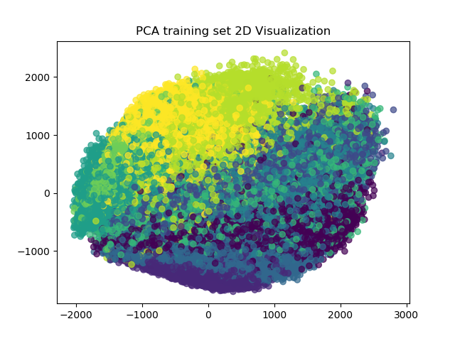
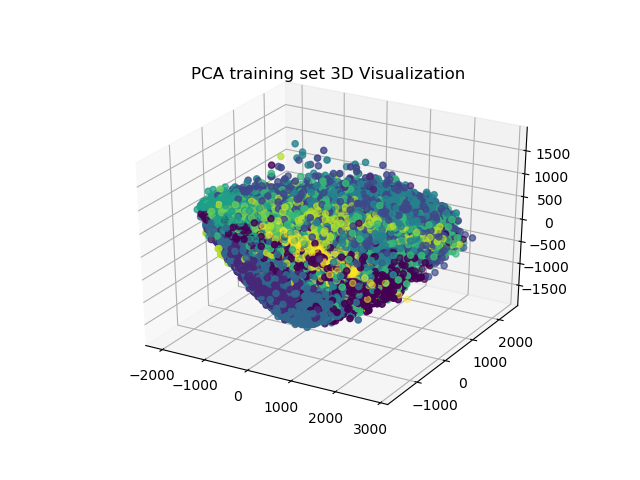
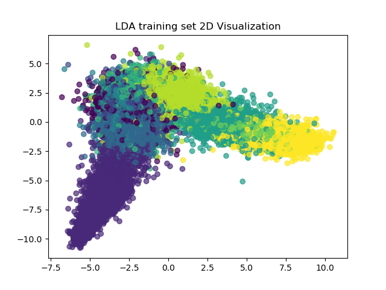
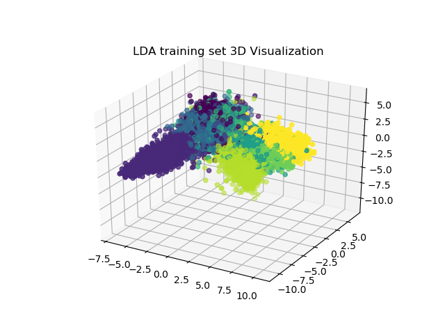
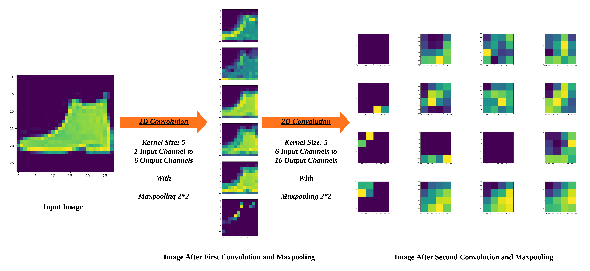
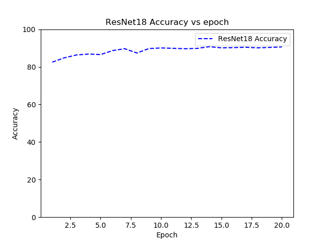
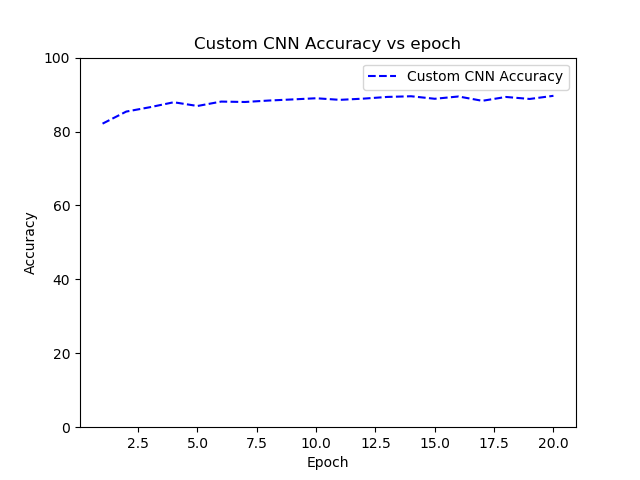

# SVM and CNN on Fashion MNIST Dataset

**Author: Zuyang Cao**

## Overview
This project employed two types of machine learning methods to classify the fashion MNIST dataset:

- Support Vector Machine
- Convolutional Neural Network
  - Resnet
  - VGGnet
  - Alexnet

Two dimensionality reduction techniques are applied on SVM: 
 
- PCA (Principal Component Analysis)
- LDA (Linear Discriminant Analysis)

## Dataset

[Fashion-MNIST](https://github.com/zalandoresearch/fashion-mnist) is a dataset of Zalando's article images—consisting of a training set of 60,000 examples and a test set of 10,000 examples. Each example is a 28x28 grayscale image, associated with a label from 10 classes.

*Figure 1. Visualized Dataset*

## Tunable Parameters

### PCA Parameters
- **pca_target_dim:** Using PCA to reduce the data dimension to this number.

### LDA Parameters
- **components_number:** Number of components (< n_classes - 1) for dimensionality reduction.

### SVM Parameters
- **kernel:** Kernel of Support Vector Machine.

## Results

###  Dimensionality Reduction Visualization

- PCA

*Figure 2. PCA training set 2D*

*Figure 3. PCA training set 3D*

- LDA

*Figure 4. LDA training set 2D*

*Figure 5. LDA training set 3D*

For more visualization images, please refer to visualization folder.

### SVM with Different Kernels

- SVM Poly vs RBF

Dataset | SVM Poly | SVM RBF
-------- | -------------- | ------------ 
LDA Training set | 84.47% | 85.19%
PCA Training set | 87.87% | 88.35%
LDA Testing set | 82.49 % | 83.41 %
PCA Testing set | 86.03 % | **86.59 %**

- SVM Time Cost

Dataset | SVM Poly | SVM RBF
-------- | -------------- | ------------ 
Training set | 148.41s | 172.30s
Testing set | **73.51s** | 81.74s

From accuracy perspective, SVM with RBF kernel is better but it takes longer training time than Ploy kernel.
And SVM with Linear kernel spent too long to take into account. Thus, only RBF and Poly kernel are tested here.

### CNN

#### Existing CNN Models
Three kinds of Convolutional Neural Network (Resnet, VGGnet, Alexnet) are applied to classify the dataset.

*Figure 6. Structural diagram for VGG and Resnet (source from link)*

- Different CNN Models

Model | Accuracy | Epoch | Training Time
----- | -------- | ----- | -------------
Resnet18 | 84.19% | 2 | 18.37 mins
Resnet18 | 89.91% | 10 | 91.41 mins
Resnet50 | 78.24% | 4 | 82.88 mins
VGGnet16 | 89.71 % | 2 | 63.65 mins
Alexnet | 84.38 % | 2 | 22.60 mins

Time consumption based on NVIDIA GTX 1050 (CUDA 10.2).

#### Custom CNN Model

- Convolution Structure

Below is an example of convolution structure used in one custom CNN model.

*Figure 7. Convolution Structure for Custom CNN*

- CNN Accuracy vs Epochs

*Figure 8. Resnet18 Accuracy vs Epochs*

*Figure 9. Custom CNN Accuracy vs Epochs*

Epoch | Resnet18 Accuracy | Custom CNN
-------- | -------------- | ----------
1 | 82.51 % | 82.13%
2 | 84.81 % | 85.40%
3 | 86.33 % | 86.58%
4 | 86.82 % | 87.92%
5 | 86.54 % | 86.91%
6 | 88.67 % | 88.10%
7 | 89.66 % | 87.99%
8 | 87.37 % | 88.38%
9 | 89.73 % | 88.68%
10 | 90.07 % | 89.00%
11 | 89.87 % | 88.57%
12 | 89.65 % | 88.90%
13 | 89.83 % | 89.36%
14 | **90.75 %** | 89.54%
15 | 90.11 % | 88.86%
16 | 90.23 % | 89.48%
17 | 90.46 % | 88.31%
18 | 90.12 % | 89.35%
19 | 90.35 % | 88.81%
20 | 90.61 % | **89.66**
**Total Time** | 110.11mins | 19.77mins

Time consumption based on NVIDIA GTX 1080 (CUDA 10.2). The accuracy start to converge after approximately 15 epochs.
The common parameters for CNN models are set to be same in both conditions (for example mini-batches) in order to 
compare. 

